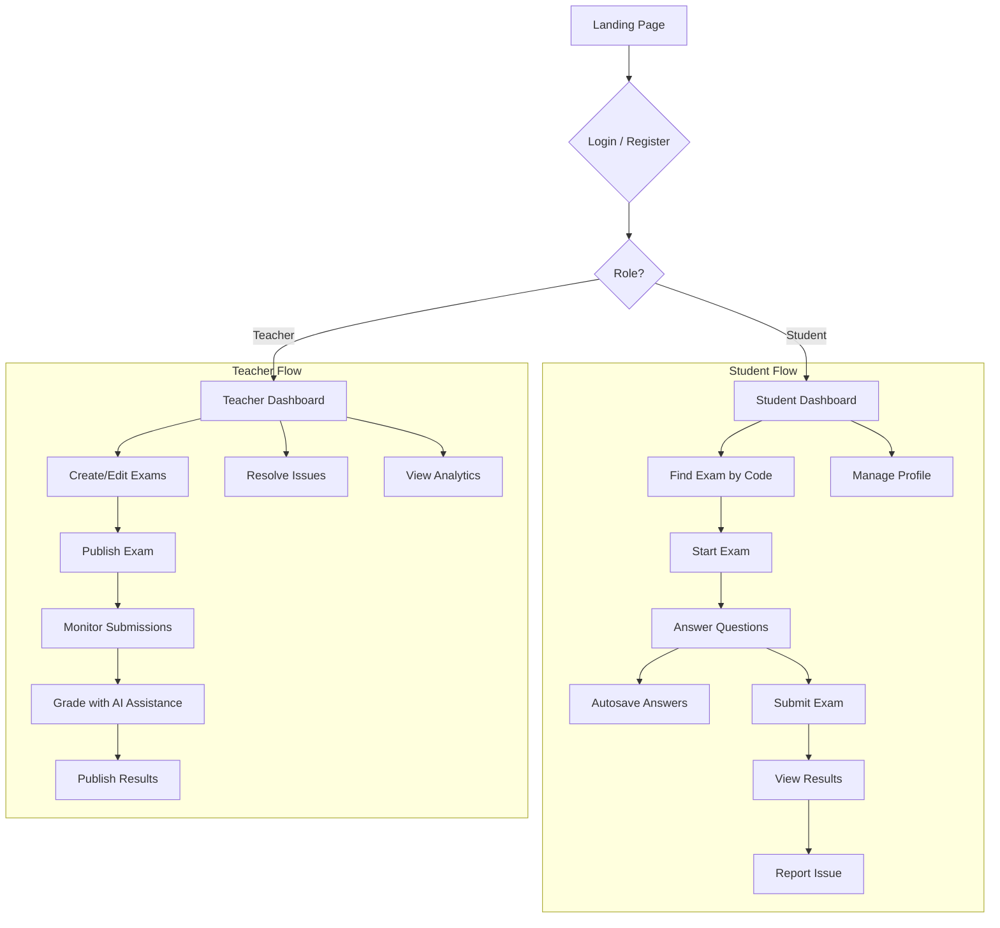

# AI-Based Exam Evaluation System

[](https://opensource.org/licenses/ISC)  
[](https://reactjs.org/)  
[](https://nodejs.org/)  
[](https://expressjs.com/)  
[](https://www.mongodb.com/)

A modern, full-stack MERN (MongoDB, Express, React, Node.js) exam management system featuring AI-assisted grading, real-time collaboration, and a polished responsive UI with dark mode support.

---

## ✨ Overview

This system streamlines the entire exam lifecycle from creation to grading, providing teachers and students with a professional platform for conducting online assessments. Built with modern web technologies and best practices, it emphasizes **reliability** (autosave), **auditability** (comprehensive logging), and **extensibility** (AI evaluation pipeline).

**Key Highlights:**
- 🎨 Modern, responsive UI with dark/light mode
- ⚡ Real-time updates via Socket.IO
- 🤖 AI-assisted grading for subjective questions
- 💾 Automatic answer saving (prevents data loss)
- 🔐 Secure JWT authentication
- 📊 Comprehensive analytics dashboards
- 🎯 Multiple question types (MCQ, Subjective)
- 🐛 Built-in issue reporting system

---

## 🚀 Core Features

### For Students

#### 📚 Exam Management
- **Dashboard**: Professional home page with stats, recent activity, and profile card
- **Exam Search**: Find exams using unique search codes
- **Live Exam Interface**: 
  - Clean, focused UI with question navigation
  - Real-time autosave (every 30 seconds)
  - Mark questions for review
  - Timer with visual feedback
  - Tab switch detection
- **Results**: Detailed per-question feedback with scores and AI evaluations

#### ⚙️ Profile & Settings
- **Complete Profile Management**: Update name, email, phone, gender, and address
- **Partial Updates**: Only modified fields are sent to server
- **Password Management**: Secure password change functionality
- **Responsive Design**: Works seamlessly on mobile, tablet, and desktop

#### 🛠️ Issue Reporting
- Create issues for exam problems or grading disputes
- Track issue status in real-time
- Receive notifications when issues are resolved
- Attach exam submissions to issues

### For Teachers

#### 📝 Exam Creation & Management
- **Rich Exam Creation**: 
  - Multiple question types (MCQ with multiple correct answers, Subjective)
  - Set duration, start/end times, and access policies
  - Configure AI grading policies per question
  - Generate unique search codes
- **Exam Editing**: Update questions, settings, and policies
- **Exam Management**: Publish, unpublish, filter, and search exams
- **Real-time Monitoring**: Track student progress live

#### 📊 Grading & Evaluation
- **AI-Assisted Grading**: Automatic evaluation of subjective answers
- **Manual Override**: Review and adjust AI-generated scores
- **Batch Operations**: Grade multiple submissions efficiently
- **Detailed Analytics**: Track performance metrics

#### 👥 Student Management
- View all submissions by exam or student
- Monitor exam attempts in real-time
- Track completion rates and scores
- Issue management and resolution

#### 🏠 Professional Dashboard
- Comprehensive stats (total exams, live exams, pending reviews, open issues)
- Recent submissions feed
- Profile management with avatar
- Quick access to all features

---

## 🎨 UI/UX Features

### Modern Design System
- **CSS Variables**: Consistent theming throughout the app
- **Dark Mode**: Automatic dark/light mode switching
- **Responsive Typography**: Fluid font sizes using CSS `clamp()`
- **Consistent Components**: Reusable KPI cards, status badges, and alerts
- **Smooth Animations**: Transitions, hover effects, and loading states
- **Professional Color Palette**: Carefully chosen colors for different states

### Responsive Layouts
- **Two-Column Dashboards**: Profile sidebar + main content (desktop)
- **Stacked Mobile**: Automatic single-column layout on mobile
- **Breakpoint**: 880px for optimal tablet/desktop experience
- **Touch-Friendly**: Minimum 44px touch targets

### Loading States
- **Skeleton Screens**: Professional placeholders during data fetch
- **Pulse Animations**: Smooth loading indicators
- **Inline Loading**: Context-aware loading states

---

## 🏗️ Technology Stack

### Frontend
- **React 19**: Latest React with improved performance
- **Vite 7**: Lightning-fast build tool and dev server
- **React Router 7**: Client-side routing
- **Socket.IO Client**: Real-time bi-directional communication
- **Axios**: HTTP client for API requests
- **Framer Motion**: Smooth animations
- **Lucide React**: Modern icon library
- **Recharts**: Data visualization

### Backend
- **Node.js 18+**: JavaScript runtime
- **Express 5**: Web application framework
- **MongoDB 8**: NoSQL database
- **Mongoose**: ODM for MongoDB
- **Socket.IO**: Real-time engine
- **JWT**: Secure authentication
- **Express Validator**: Input validation
- **Bcrypt**: Password hashing
- **Helmet**: Security headers
- **Morgan**: HTTP request logger

### Development Tools
- **ESLint**: Code linting
- **Nodemon**: Auto-restart during development
- **Dotenv**: Environment variable management

---

## 📐 Architecture

### High-Level Flow



### Data Models

#### Student Model
- Authentication (username, email, password)
- Profile (fullname, phone, gender)
- Address (street, city, state, postalCode, country)
- Timestamps

#### Teacher Model
- Authentication (username, email, password)
- Profile (fullname, phone, department)
- Address (street, city, state, postalCode, country)
- Timestamps

#### Exam Model
- Metadata (title, description, duration)
- Questions (references to Question model)
- Timing (startTime, endTime)
- Access control (searchCode, status)
- AI policy configuration

#### Question Model
- Type (MCQ, Subjective)
- Content (text, options)
- Grading (maxMarks, correctAnswers for MCQ)
- AI policy (rubric, keywords)

#### Submission Model
- References (student, exam)
- Answers array (question, responseText, responseOption)
- Metadata (status, startedAt, submittedAt)
- Evaluation results
- Marked for review

#### Issue Model
- References (student, submission, exam)
- Content (issueType, description)
- Status tracking (open, resolved)
- Reply system
- Timestamps

---

## 🔌 API Endpoints

### Authentication

#### Student Authentication
```
POST   /api/students/register          - Register new student
POST   /api/students/login              - Student login
POST   /api/students/logout             - Student logout
GET    /api/students/profile            - Get profile
PUT    /api/students/update             - Update profile (partial)
PUT    /api/students/change-password   - Change password
```

#### Teacher Authentication
```
POST   /api/teachers/register          - Register new teacher
POST   /api/teachers/login              - Teacher login
POST   /api/teachers/logout             - Teacher logout
GET    /api/teachers/profile            - Get profile
PUT    /api/teachers/update             - Update profile (partial)
PUT    /api/teachers/change-password   - Change password
```

### Exams
```
POST   /api/exams                       - Create exam (Teacher)
GET    /api/exams                       - List exams (Teacher)
GET    /api/exams/:id                   - Get exam details
PUT    /api/exams/:id                   - Update exam (Teacher)
DELETE /api/exams/:id                   - Delete exam (Teacher)
GET    /api/exams/search/:code          - Find exam by search code (Student)
POST   /api/exams/:id/publish           - Publish exam (Teacher)
```

### Questions
```
POST   /api/questions                   - Create question (Teacher)
PUT    /api/questions/:id               - Update question (Teacher)
DELETE /api/questions/:id               - Delete question (Teacher)
```

### Submissions
```
POST   /api/submissions/start/:examId   - Start exam (Student)
GET    /api/submissions/my-submissions  - Get student submissions
GET    /api/submissions/:id             - Get submission details
PATCH  /api/submissions/:id/answers     - Autosave answers (Student)
POST   /api/submissions/:id/submit      - Submit exam (Student)
GET    /api/submissions/results/:id     - Get results (Student)
POST   /api/submissions/:id/violation   - Report violation (Student)
```

### Grading
```
GET    /api/teacher/submissions         - List all submissions (Teacher)
GET    /api/teacher/submissions/:id     - Get submission for grading
POST   /api/teacher/submissions/:id/grade - Grade submission (Teacher)
POST   /api/submissions/test-evaluation - Test AI evaluation
```

### Issues
```
POST   /api/issues/create               - Create issue (Student)
GET    /api/issues/student              - Get student issues
GET    /api/issues/me                   - Alternative endpoint
GET    /api/issues/:id                  - Get issue details
POST   /api/issues/:id/reply            - Reply to issue
DELETE /api/issues/:id                  - Delete issue (Student)
```

---

## 📁 Project Structure

```
AI-Based-Exam-Evaluation-System/
├── client/                          # Frontend React application
│   ├── public/                     # Static assets
│   ├── src/
│   │   ├── main.jsx               # Application entry point
│   │   ├── App.jsx                # Root component
│   │   ├── index.css              # Global styles with CSS variables
│   │   ├── components/            # Reusable components
│   │   │   ├── ErrorBoundary.jsx
│   │   │   ├── Header.jsx
│   │   │   ├── Login.jsx
│   │   │   ├── Register.jsx
│   │   │   ├── Sidebar.jsx
│   │   │   └── ...
│   │   ├── context/               # React contexts
│   │   │   ├── AuthContext.jsx
│   │   │   └── ThemeContext.jsx
│   │   ├── hooks/                 # Custom React hooks
│   │   │   ├── useAuth.js
│   │   │   └── useTheme.js
│   │   ├── pages/                 # Page components
│   │   │   ├── student/
│   │   │   │   ├── Home.jsx           # Dashboard with stats
│   │   │   │   ├── Exams.jsx          # Exam search
│   │   │   │   ├── TakeExam.jsx       # Exam interface
│   │   │   │   ├── result.jsx         # Results page
│   │   │   │   ├── issue.jsx          # Issue reporting
│   │   │   │   ├── Settings.jsx       # Profile management
│   │   │   │   └── Settings.css
│   │   │   └── teacher/
│   │   │       ├── Home.jsx           # Teacher dashboard
│   │   │       ├── Exams.jsx          # Exam management
│   │   │       ├── ExamCreate.jsx     # Create exams
│   │   │       ├── ExamEdit.jsx       # Edit exams
│   │   │       ├── SubmissionGrade.jsx # Grading interface
│   │   │       ├── result.jsx         # Results management
│   │   │       ├── issue.jsx          # Issue management
│   │   │       ├── Settings.jsx       # Profile management
│   │   │       └── Settings.css
│   │   ├── routes/                # Route configuration
│   │   ├── services/              # API services
│   │   │   ├── api.js
│   │   │   ├── studentServices.js
│   │   │   └── teacherServices.js
│   │   └── utils/                 # Utility functions
│   ├── package.json
│   └── vite.config.js
│
└── server/                          # Backend Node.js application
    ├── src/
    │   ├── server.js               # Server entry point
    │   ├── app.js                  # Express app configuration
    │   ├── db.js                   # Database connection
    │   ├── controllers/            # Route controllers
    │   │   ├── student.controller.js
    │   │   ├── teacher.controller.js
    │   │   ├── exam.controller.js
    │   │   ├── question.controller.js
    │   │   ├── submission.controller.js
    │   │   └── issue.controller.js
    │   ├── models/                 # Mongoose models
    │   │   ├── student.model.js
    │   │   ├── teacher.model.js
    │   │   ├── exam.model.js
    │   │   ├── question.model.js
    │   │   ├── submission.model.js
    │   │   └── issue.model.js
    │   ├── routes/                 # API routes
    │   │   ├── student.routes.js
    │   │   ├── teacher.routes.js
    │   │   ├── exam.routes.js
    │   │   ├── question.routes.js
    │   │   ├── submission.routes.js
    │   │   └── issue.routes.js
    │   ├── middlewares/            # Express middlewares
    │   │   ├── auth.middleware.js
    │   │   └── cors.middleware.js
    │   ├── services/               # Business logic
    │   │   ├── evaluation.service.js
    │   │   └── examStatus.service.js
    │   ├── socket/                 # Socket.IO configuration
    │   │   └── initSocket.js
    │   └── utils/                  # Utility functions
    │       ├── ApiError.js
    │       ├── ApiResponse.js
    │       └── asyncHandler.js
    └── package.json
```

---

## 🚀 Getting Started

### Prerequisites

- **Node.js** 18 or higher
- **MongoDB** 4.4 or higher (local or MongoDB Atlas)
- **npm** or **yarn**
- **Git**

### Installation

1. **Clone the repository**
   ```bash
   git clone https://github.com/yourusername/AI-Based-Exam-Evaluation-System.git
   cd AI-Based-Exam-Evaluation-System
   ```

2. **Setup Backend**
   ```bash
   cd server
   npm install
   ```

   Create `server/.env`:
   ```env
   # Database
   MONGODB_URI=mongodb://localhost:27017/exam-evaluation
   
   # JWT
   ACCESS_TOKEN_SECRET=your-super-secret-access-token-key-change-this
   REFRESH_TOKEN_SECRET=your-super-secret-refresh-token-key-change-this
   ACCESS_TOKEN_EXPIRY=24h
   REFRESH_TOKEN_EXPIRY=7d
   
   # Server
   PORT=3003
   NODE_ENV=development
   
   # CORS
   CORS_ORIGIN=http://localhost:5173
   
   # AI Evaluation Service (optional)
   AI_SERVICE_URL=http://localhost:5000
   ```

   Start the server:
   ```bash
   npm run dev
   ```

3. **Setup Frontend**
   ```bash
   cd ../client
   npm install
   ```

   Create `client/.env` (optional):
   ```env
   VITE_API_BASE_URL=http://localhost:3003
   ```

   Start the development server:
   ```bash
   npm run dev
   ```

4. **Access the Application**
   - Frontend: http://localhost:5173
   - Backend API: http://localhost:3003

### First-Time Setup

1. Register a teacher account
2. Register a student account
3. As teacher: Create an exam with questions
4. As teacher: Publish the exam and note the search code
5. As student: Use the search code to find and start the exam

---

## 🔒 Environment Variables

### Server (.env)

| Variable | Description | Required | Default |
|----------|-------------|----------|---------|
| `MONGODB_URI` | MongoDB connection string | ✅ | - |
| `ACCESS_TOKEN_SECRET` | JWT access token secret | ✅ | - |
| `REFRESH_TOKEN_SECRET` | JWT refresh token secret | ✅ | - |
| `ACCESS_TOKEN_EXPIRY` | Access token expiration | ❌ | 24h |
| `REFRESH_TOKEN_EXPIRY` | Refresh token expiration | ❌ | 7d |
| `PORT` | Server port | ❌ | 3003 |
| `NODE_ENV` | Environment | ❌ | development |
| `CORS_ORIGIN` | Allowed frontend origin | ✅ | - |
| `AI_SERVICE_URL` | AI evaluation service URL | ❌ | - |

### Client (.env)

| Variable | Description | Required | Default |
|----------|-------------|----------|---------|
| `VITE_API_BASE_URL` | Backend API base URL | ❌ | http://localhost:3003 |

---

## 🎯 Key Features Implementation

### Partial Update Logic

Both student and teacher settings pages implement efficient partial updates:

```javascript
// Only send changed fields
const payload = {};
if (username !== originalProfile.username) {
    payload.username = username.trim();
}
// ... only modified fields added to payload

await updateProfile(payload);
```

**Benefits:**
- Reduced network traffic
- Prevents unnecessary database writes
- Handles optional fields correctly (sends `null` for empty values)

### Autosave System

The exam interface automatically saves progress every 30 seconds:

```javascript
// Debounced autosave
const saveAnswers = useCallback(debounce(async (answers) => {
    await saveSubmissionAnswers(submissionId, { answers });
}, 30000), [submissionId]);
```

**Features:**
- Prevents data loss
- Works with unstable connections
- Visual feedback during save
- Manual save option available

### Real-Time Updates

Socket.IO powers real-time features:

```javascript
// Server emits events
socket.emit('new-submission', submissionData);
socket.emit('submission-updated', { submissionId, status });
socket.emit('issue-status-changed', issueData);

// Client listens for updates
socket.on('new-submission', (data) => {
    updateDashboard(data);
});
```

**Use Cases:**
- Live submission monitoring
- Issue status updates
- Real-time grading feedback

### Theme System

Comprehensive dark/light mode using CSS variables:

```css
:root {
    --bg: #ffffff;
    --surface: #ffffff;
    --text: #0f172a;
    --border: #e5e7eb;
}

[data-theme="dark"] {
    --bg: #0f172a;
    --surface: #1e293b;
    --text: #e2e8f0;
    --border: #334155;
}
```

Toggle theme programmatically or via system preference.

---

## 🐛 Troubleshooting

### Common Issues

#### Cannot Connect to Database
```
Error: connect ECONNREFUSED 127.0.0.1:27017
```
**Solution**: Ensure MongoDB is running locally or check your `MONGODB_URI` connection string.

#### CORS Errors
```
Access to XMLHttpRequest has been blocked by CORS policy
```
**Solution**: Verify `CORS_ORIGIN` in server `.env` matches your frontend URL (e.g., `http://localhost:5173`).

#### Autosave Not Working
**Symptoms**: Answers don't persist after refresh

**Solutions**:
1. Check browser console for network errors
2. Verify JWT token is valid
3. Ensure `submission.id` exists before autosave
4. Check server logs for PATCH `/api/submissions/:id/answers` errors

#### Profile Data Not Showing
**Symptoms**: Dashboard shows placeholder data

**Solutions**:
1. Verify `getStudentProfile()` or `getTeacherProfile()` is called on mount
2. Check network tab for 401 errors (auth issue)
3. Ensure backend returns complete profile data

#### Dark Mode Not Working
**Solution**: Check if `data-theme="dark"` attribute is set on `<html>` or root element.

---

## 📊 API Response Formats

### Success Response
```json
{
    "success": true,
    "data": { ... },
    "message": "Operation successful"
}
```

### Error Response
```json
{
    "success": false,
    "message": "Error description",
    "errors": [ ... ]  // Optional validation errors
}
```

---

## 🔐 Security Features

-  **JWT Authentication**: Secure token-based auth
- ✅ **Password Hashing**: Bcrypt with salt rounds
- ✅ **CORS Protection**: Configurable origins
- ✅ **Input Validation**: Express-validator
- ✅ **Security Headers**: Helmet middleware
- ✅ **Rate Limiting**: Prevents abuse
- ✅ **SQL Injection Prevention**: Mongoose ODM
- ✅ **XSS Protection**: Content sanitization

---

## 🚧 Roadmap

### Near-term
- [ ] Email verification for registration
- [ ] Password reset via email
- [ ] File upload for questions/answers
- [ ] Export results to PDF/CSV
- [ ] Advanced analytics for teachers

### Long-term
- [ ] Code editor questions (for programming exams)
- [ ] Improved AI rubrics and multi-pass grading
- [ ] Proctoring features (webcam, screen recording)
- [ ] Mobile apps (React Native)
- [ ] LMS integration (Canvas, Moodle)
- [ ] Accessibility improvements (WCAG 2.1 AA)

---

## 🤝 Contributing

We welcome contributions! Please follow these steps:

1. Fork the repository
2. Create a feature branch (`git checkout -b feature/amazing-feature`)
3. Commit your changes (`git commit -m 'Add amazing feature'`)
4. Push to the branch (`git push origin feature/amazing-feature`)
5. Open a Pull Request

### Development Guidelines

- Follow existing code style
- Write meaningful commit messages
- Add comments for complex logic
- Test your changes thoroughly
- Update documentation as needed

---

## 📝 License

This project is licensed under the ISC License - see the [LICENSE](./LICENSE) file for details.

---

## 👥 Authors

- **Your Name** - *Initial work*

---

## 🙏 Acknowledgments

- React team for the amazing framework
- MongoDB for the flexible database
- Socket.IO for real-time capabilities
- All contributors and users

---

## 📞 Support

For issues, questions, or suggestions:
- Open an issue on GitHub
- Contact: your.email@example.com

---

**Made with ❤️ using the MERN stack**
