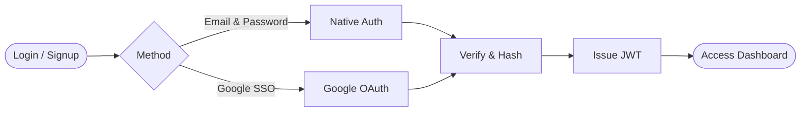
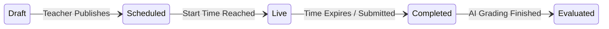
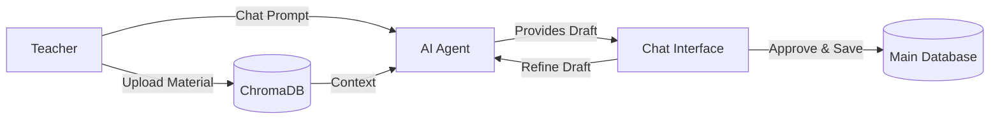

<h1 align="center">AI-Based Exam Evaluation System</h1>

<p align="center">
  <a href="https://opensource.org/licenses/ISC"></a>
  <a href="https://reactjs.org/"></a>
  <a href="https://nodejs.org/"></a>
  <a href="https://expressjs.com/"></a>
  <a href="https://www.mongodb.com/"></a>
  <a href="https://fastapi.tiangolo.com/"></a>
  <a href="https://www.langchain.com/langgraph"></a>
  <a href="https://tailwindcss.com/"></a>
</p>

<p align="center">
  A modern, microservice-driven exam platform designed for educators and students. It utilizes <b>conversational AI agents</b> to help you instantly draft exams from your own classroom materials, and employs a <b>strict Retrieval-Augmented Generation (RAG)</b> evaluation process to fairly and accurately grade student's subjective answers—ensuring zero hallucination and complete transparency.
</p>

<p align="center">
  <a href="https://ai-based-exam-evaluation-system.vercel.app"><b>🌐 Live Demo</b></a> •
  <a href="#-getting-started"><b>🚀 Getting Started</b></a> •
  <a href="#-api-guide"><b>📡 API Guide</b></a> •
  <a href="#-contributing"><b>🤝 Contributing</b></a>
</p>

---

## 📑 Table of Contents

- [Core Features](#-core-features)
- [How It Works](#-how-it-works)
  - [Authentication](#authentication)
  - [The Exam Journey](#the-exam-journey)
  - [AI Agent Integration](#ai-agent-integration)
- [Tech Stack](#-tech-stack)
- [Project Layout](#-project-layout)
- [API Guide](#-api-guide)
- [Getting Started](#-getting-started)
- [Deployment](#-deployment)
- [Contributing](#-contributing)
- [License](#-license)

---

## ✨ Core Features

### 🤖 Smart AI Integration
*   **Conversational Exam Generation:** Upload a PDF or DOCX file to your classroom. Chat with our AI agent to instantly generate an exam draft based on that exact material. Refine it interactively until it's perfect.
*   **Honest AI Grading:** When students submit long-form answers, the AI grades them strictly based on the reference materials provided. It is explicitly programmed to avoid using outside knowledge.
*   **Reliable AI Fallback:** Our backend seamlessly switches between top-tier AI models (Groq, Cerebras, OpenRouter, HuggingFace) ensuring the system stays online even if one provider goes down.

### 🎓 Classroom & Exam Management
*   **Classroom Hub:** Teachers can create distinct classrooms and share join codes with students. All materials and exams are organized per classroom.
*   **Controlled Exam States:** Exams safely move from *Draft* to *Scheduled*, go *Live* when the time is right, and automatically mark as *Completed* when time runs out.
*   **Anti-Cheat & Autosave:** Real-time autosaving ensures no student loses their work. The system actively monitors and logs if a student switches tabs or leaves the exam window.

### 🛡️ Security & Performance
*   **Secure Access:** Choose between standard email/password logins (encrypted) or quick 1-click Google sign-ins.
*   **Real-time Updates:** Using WebSockets, the dashboard updates instantly when exam statuses change or when an AI agent finishes drafting a question.
*   **Detailed Analytics:** Interactive charts allow teachers to quickly understand class performance, view score distributions, and intervene with manual grade overrides if necessary.

---

## 🔄 How It Works

Here is a simplified look at the workflows that power the platform.

### Authentication

Users can sign up using a traditional email and password, or use their Google account. The backend secures the session using rotating JSON Web Tokens (JWT).


```mermaid
flowchart LR
    Start([Login / Signup]) --> AuthChoice{Method}
    AuthChoice -->|Email & Password| Native[Native Auth]
    AuthChoice -->|Google SSO| OAuth[Google OAuth]
    Native --> Check[Verify & Hash]
    OAuth --> Check
    Check --> Token[Issue JWT]
    Token --> Dashboard([Access Dashboard])
```

### The Exam Journey

Every exam follows a strict lifecycle, managed by the backend to prevent unauthorized access.


```mermaid
stateDiagram-v2
    direction LR
    Draft --> Scheduled: Teacher Publishes
    Scheduled --> Live: Start Time Reached
    Live --> Completed: Time Expires / Submitted
    Completed --> Evaluated: AI Grading Finished
```

### AI Agent Integration

The AI agent sits in a detached Python microservice. It uses **LangGraph** to maintain a conversation state, allowing teachers to give feedback like *"Make the questions slightly harder"* without regenerating the entire exam from scratch.


```mermaid
flowchart LR
    Teacher[Teacher] -->|Upload Material| RAG[(ChromaDB)]
    Teacher -->|Chat Prompt| Agent[AI Agent]
    RAG -->|Context| Agent
    Agent -->|Provides Draft| Chat[Chat Interface]
    Chat -->|Refine Draft| Agent
    Chat -->|Approve & Save| DB[(Main Database)]
```

---

## 🛠️ Tech Stack

We've chosen a robust, modern stack to ensure the platform is fast, scalable, and easy to maintain.

*   **Frontend:** React 19, Vite, Tailwind CSS 4, Recharts (for analytics), Framer Motion (for animations).
*   **Backend:** Node.js 18+, Express 5, MongoDB Atlas (Database), Socket.IO (Real-time events), BullMQ & Upstash Redis (Job queue and caching).
*   **AI Microservice:** Python 3.12, FastAPI, LangGraph (Agent workflows), ChromaDB (Vector store for RAG).

---

## 📂 Project Layout

The repository is divided into three main workspaces:

```text
AI-Based-Exam-Evaluation-System/
├── client/                 # The React Frontend (Vite)
│   ├── src/components/     # Reusable UI elements
│   ├── src/pages/          # Teacher and Student views
│   └── src/services/       # API integration logic
│
├── server/                 # The Node.js Backend (Express)
│   ├── src/controllers/    # Core business logic and route handlers
│   ├── src/models/         # MongoDB database schemas
│   └── src/services/       # Background tasks (Email, AI integration, etc.)
│
└── agent-service/          # The Python AI Microservice (FastAPI)
    ├── agent/              # LangGraph agent definitions and workflows
    ├── rag/                # Document extraction and ChromaDB management
    └── prompts/            # Tuned instructions for the AI models
```

---

## 📡 API Guide

The backend exposes a comprehensive RESTful API, prefixed with `/api/v1`. Here is an overview of the primary route groups and what they handle.

### 🔑 Authentication (`/api/v1/auth`)
Handles user identity and session security.
*   **Registration & Login:** Routes for creating accounts and logging in natively or via Google OAuth.
*   **Token Management:** Secure endpoints to refresh expired access tokens or log out entirely.
*   **Account Recovery:** Standard flows for verifying email addresses and resetting forgotten passwords.

### 🏫 Classrooms (`/api/v1/classrooms`)
Manages the virtual spaces where teaching happens.
*   **Creation & Discovery:** Teachers can create classrooms; students can preview and request to join them.
*   **Roster Management:** Teachers have full control to approve, reject, or remove students.
*   **Materials:** Endpoints to upload PDFs/DOCX files. Uploaded files trigger an automatic AI processing job so they can be referenced in future exams.

### 📝 Exams (`/api/v1/exams`)
The core CRUD operations for tests and quizzes.
*   **Drafting:** Create exams, add/remove/reorder questions, or completely duplicate a previous exam.
*   **State Management:** Publish an exam to schedule it, cancel it, or immediately end a live exam if necessary.
*   **Insights:** Fetch aggregated statistics on how the class performed overall.

### 🙋 Questions (`/api/v1/questions`)
A dedicated resource for managing individual questions independently of exams.
*   Allows teachers to build up a personal question bank.
*   Supports bulk creation for faster data entry.

### 📥 Submissions (`/api/v1/submissions`)
Handles everything from the moment a student starts an exam to when they receive their grade.
*   **Exam Taking:** Routes to officially start an exam, securely sync (autosave) answers, and submit.
*   **Integrity:** Endpoints to log any suspicious activity (like tab switching) during a live session.
*   **Evaluation:** Triggers the AI grading process, allows teachers to review/override the AI's grade, and officially publish the results back to the student.

### 🤖 AI Agent (`/api/v1/agent`)
Proxies communication to the Python microservice.
*   **Sessions:** Start a new conversation session with the AI.
*   **Streaming:** Connect via Server-Sent Events (SSE) to watch the AI draft questions in real-time.
*   **Refinement:** Send chat messages back to the AI to tweak and finalize the exam draft before saving it to the database.

---

## 🚀 Getting Started

Follow these steps to run the complete platform on your local machine.

### 1. Prerequisites
Ensure you have the following installed:
*   Node.js (v18+)
*   Python (v3.12+)
*   A local MongoDB instance or a free MongoDB Atlas cloud account.
*   An API Key from Groq, Cerebras, OpenRouter, or HuggingFace (to power the AI).

### 2. Backend Setup (Node.js)
```bash
cd server
npm install
```
Create a `.env` file inside the `server/` directory. You will need variables for MongoDB, JWT secrets, Google OAuth, Cloudinary, Upstash Redis, and your AI API keys. *(See `server/src/app.js` and controllers for exact variable names).*

Start the backend:
```bash
npm run dev
```

### 3. Frontend Setup (React)
```bash
cd client
npm install
```
Create a `.env` file inside the `client/` directory:
```env
VITE_API_BASE_URL=http://localhost:8000
VITE_GOOGLE_CLIENT_ID=your_google_client_id_here
```
Start the frontend:
```bash
npm run dev
```

### 4. Agent Microservice Setup (Python)
```bash
cd agent-service
python -m venv venv
# Activate the environment (Windows: venv\Scripts\activate | Mac/Linux: source venv/bin/activate)
pip install -r requirements.txt
```
Create a `.env` file inside the `agent-service/` directory and add your chosen LLM API keys (e.g., `GROQ_API_KEY`, `HF_API_KEY`).

Start the microservice:
```bash
uvicorn main:app --host 0.0.0.0 --port 8001 --reload
```

---

## 🌍 Deployment

The platform is designed to be deployed across specialized cloud providers:

*   **Frontend (React):** Vercel (Fast edge delivery).
*   **Backend (Node.js):** Render (Reliable Docker-based web service).
*   **Agent Service (Python):** Render (Dockerized API).

Ensure that all `.env` variables are properly mirrored in your respective hosting provider's dashboard.

---

## 🤝 Contributing

We welcome improvements, bug fixes, and new features! 

1.  **Fork** this repository.
2.  **Create a branch** for your feature (`git checkout -b feature/amazing-new-feature`).
3.  **Commit** your changes cleanly.
4.  **Push** to your branch (`git push origin feature/amazing-new-feature`).
5.  **Open a Pull Request** explaining what you changed and why.

---

## 📝 License

This project is licensed under the **ISC License**.

<p align="center">
  Built with ❤️ for better education.
</p>
