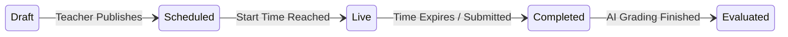
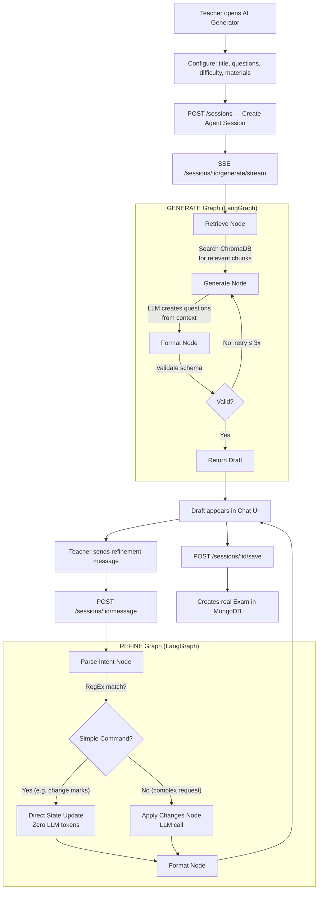
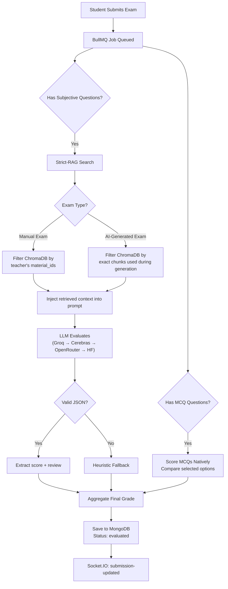

<h1 align="center">AI-Based Exam Evaluation System</h1>

<p align="center">
  <a href="https://opensource.org/licenses/ISC"></a>
  <a href="https://reactjs.org/"></a>
  <a href="https://nodejs.org/"></a>
  <a href="https://expressjs.com/"></a>
  <a href="https://www.mongodb.com/"></a>
  <a href="https://fastapi.tiangolo.com/"></a>
  <a href="https://www.langchain.com/langgraph"></a>
  <a href="https://tailwindcss.com/"></a>
</p>

<p align="center">
  A modern, microservice-driven exam platform designed for educators and students. It utilizes <b>conversational AI agents</b> to help you instantly draft exams from your own classroom materials, and employs a <b>strict Retrieval-Augmented Generation (RAG)</b> evaluation process to fairly and accurately grade student's subjective answers—ensuring zero hallucination and complete transparency.
</p>

<p align="center">
  <a href="https://ai-based-exam-evaluation-system.vercel.app"><b>🌐 Live Demo</b></a> •
  <a href="#-getting-started"><b>🚀 Getting Started</b></a> •
  <a href="#-api-guide"><b>📡 API Guide</b></a> •
  <a href="#-contributing"><b>🤝 Contributing</b></a>
</p>

---

## 📑 Table of Contents

- [Core Features](#-core-features)
- [How It Works](#-how-it-works)
- [System Design Principles](#-system-design-principles)
- [AI Architecture Deep Dive](#-ai-architecture-deep-dive)
- [Tech Stack](#-tech-stack)
- [Project Layout](#-project-layout)
- [API Guide](#-api-guide)
- [Getting Started](#-getting-started)
- [Deployment](#-deployment)
- [Contributing](#-contributing)
- [License](#-license)

---

## ✨ Core Features

### 🤖 Smart AI Integration
*   **Conversational Exam Generation:** Upload a PDF or DOCX file to your classroom. Chat with our AI agent to instantly generate an exam draft based on that exact material. Refine it interactively until it's perfect.
*   **Honest AI Grading:** When students submit long-form answers, the AI grades them strictly based on the reference materials provided. It is explicitly programmed to avoid using outside knowledge.
*   **Reliable AI Fallback:** Our backend seamlessly switches between top-tier AI models (Groq, Cerebras, OpenRouter, HuggingFace) ensuring the system stays online even if one provider goes down.

### 🎓 Classroom & Exam Management
*   **Classroom Hub:** Teachers can create distinct classrooms and share join codes with students. All materials and exams are organized per classroom.
*   **Controlled Exam States:** Exams safely move from *Draft* to *Scheduled*, go *Live* when the time is right, and automatically mark as *Completed* when time runs out.
*   **Anti-Cheat & Autosave:** Real-time autosaving ensures no student loses their work. The system actively monitors and logs if a student switches tabs or leaves the exam window.

### 🛡️ Security & Performance
*   **Secure Access:** Choose between standard email/password logins (encrypted) or quick 1-click Google sign-ins.
*   **Real-time Updates:** Using WebSockets, the dashboard updates instantly when exam statuses change or when an AI agent finishes drafting a question.
*   **Detailed Analytics:** Interactive charts allow teachers to quickly understand class performance, view score distributions, and intervene with manual grade overrides if necessary.

---

## 🔄 How It Works

### Authentication Flow
Users can sign up using a traditional email and password, or use their Google account. The backend secures the session using rotating JSON Web Tokens (JWT).


```mermaid
flowchart LR
    Start([Login / Signup]) --> AuthChoice{Method}
    AuthChoice -->|Email & Password| Native[Native Auth]
    AuthChoice -->|Google SSO| OAuth[Google OAuth]
    Native --> Check[Verify & Hash]
    OAuth --> Check
    Check --> Token[Issue JWT]
    Token --> Dashboard([Access Dashboard])
```

### The Exam Journey
Every exam follows a strict lifecycle, managed by the backend to prevent unauthorized access.


```mermaid
stateDiagram-v2
    direction LR
    Draft --> Scheduled: Teacher Publishes
    Scheduled --> Live: Start Time Reached
    Live --> Completed: Time Expires / Submitted
    Completed --> Evaluated: AI Grading Finished
```

---

## ⚙️ System Design Principles

This platform was built adhering to modern system design principles to handle concurrent students taking exams and heavy AI workloads simultaneously.

*   **Microservice Architecture & API Gateway:** The Node.js (Express) backend acts as the primary API Gateway and security layer. Instead of blocking the Node event loop with heavy ML operations, it proxies AI requests to a completely detached Python (FastAPI) microservice.
*   **Asynchronous Event-Driven Processing:** When a student submits an exam, the AI evaluation is not processed synchronously. Instead, it is pushed to a **BullMQ** job queue backed by Redis. This allows the backend to immediately respond with a `200 OK` and evaluate thousands of submissions asynchronously in the background.
*   **Distributed Rate Limiting:** We utilize the Token Bucket algorithm via **Upstash Redis** to protect endpoints. We employ multiple granular limiters: a global rate limit to prevent DDoS, a strict limiter for AI evaluation triggers (preventing expensive API abuse), and specialized limiters for auth/email routes.
*   **Real-time Pub/Sub:** **Socket.IO** provides a real-time publish-subscribe mechanism. When a background BullMQ worker finishes grading an exam, it triggers a socket event that immediately updates the student's dashboard without a page refresh.
*   **Stateless Scalability:** Session management uses rotating JWTs (short-lived access tokens and long-lived refresh tokens) stored in secure, `HttpOnly` cookies, ensuring stateless authentication that can scale across multiple Node.js instances.

---

## 🧠 AI Architecture Deep Dive

The AI features are powered by a dedicated Python/FastAPI microservice, ensuring heavy machine learning tasks don't block the main Node.js backend.

### 1. LangGraph Agent Workflow
Instead of a simple "one-shot" prompt, exam generation uses a stateful agent built with **LangGraph**:
1. **Retrieve:** The agent searches the local **ChromaDB** vector database for context extracted from the teacher's uploaded PDFs/DOCX files.
2. **Generate:** The agent drafts a structured JSON exam.
3. **Refine:** The teacher sees the draft in a chat interface. They can send refinement commands (e.g., *"Make question 3 harder"*). The LangGraph state machine routes simple commands to a zero-token RegEx parser, and complex commands back to the LLM for updates.


```mermaid
flowchart TD
    T[Teacher opens AI Generator] --> C[Configure: title, questions, difficulty, materials]
    C --> S[POST /sessions — Create Agent Session]
    S --> G[SSE /sessions/:id/generate/stream]

    subgraph GENERATE["GENERATE Graph (LangGraph)"]
        G1[Retrieve Node] -->|"Search ChromaDB<br/>for relevant chunks"| G2[Generate Node]
        G2 -->|"LLM creates questions<br/>from context"| G3[Format Node]
        G3 -->|"Validate schema"| G4{Valid?}
        G4 -->|No, retry ≤ 3x| G2
        G4 -->|Yes| G5[Return Draft]
    end

    G --> G1
    G5 --> D[Draft appears in Chat UI]

    D --> R[Teacher sends refinement message]
    R --> M[POST /sessions/:id/message]

    subgraph REFINE["REFINE Graph (LangGraph)"]
        R1[Parse Intent Node] -->|"RegEx match?"| R2{Simple Command?}
        R2 -->|"Yes (e.g. change marks)"| R3[Direct State Update<br/>Zero LLM tokens]
        R2 -->|"No (complex request)"| R4[Apply Changes Node<br/>LLM call]
        R3 --> R5[Format Node]
        R4 --> R5
    end

    M --> R1
    R5 --> D

    D --> SAVE[POST /sessions/:id/save]
    SAVE --> EXAM[Creates real Exam in MongoDB]
```

### 2. Provider Fallback Chain
To ensure 99.9% uptime for AI evaluations, the agent service utilizes an automated fallback chain via LangChain. If the primary provider hits a rate limit or goes down, it instantly fails over:
*   **Primary:** `Groq` (llama-3.3-70b) — Lightning fast.
*   **Fallback 1:** `Cerebras` (gpt-oss-120b)
*   **Fallback 2:** `OpenRouter` (free tier routing)
*   **Fallback 3:** `HuggingFace` (Qwen2.5-72B)

### 3. Strict-RAG Evaluation
When grading subjective answers, the system uses *Strict Retrieval-Augmented Generation*. 
*   **No Hallucinations:** The LLM is restricted via prompt engineering to **only** use the chunks of text retrieved from the teacher's reference materials. 
*   If the answer isn't supported by the retrieved text, the AI correctly deducts marks, ensuring fair and explainable grading.


```mermaid
flowchart TD
    SUB[Student Submits Exam] --> Q[BullMQ Job Queued]
    Q --> MCQ{Has MCQ Questions?}
    MCQ -->|Yes| SCORE[Score MCQs Natively<br/>Compare selected options]

    Q --> SUBJ{Has Subjective Questions?}
    SUBJ -->|Yes| RAG[Strict-RAG Search]

    RAG --> FILTER{Exam Type?}
    FILTER -->|Manual Exam| F1["Filter ChromaDB by<br/>teacher's material_ids"]
    FILTER -->|AI-Generated Exam| F2["Filter ChromaDB by<br/>exact chunks used during generation"]

    F1 --> CONTEXT[Inject retrieved context into prompt]
    F2 --> CONTEXT

    CONTEXT --> LLM["LLM Evaluates<br/>(Groq → Cerebras → OpenRouter → HF)"]
    LLM --> PARSE{Valid JSON?}
    PARSE -->|Yes| EXTRACT["Extract score + review"]
    PARSE -->|No| FALLBACK[Heuristic Fallback]

    EXTRACT --> AGG[Aggregate Final Grade]
    FALLBACK --> AGG
    SCORE --> AGG

    AGG --> SAVE["Save to MongoDB<br/>Status: evaluated"]
    SAVE --> NOTIFY["Socket.IO: submission-updated"]
```

---

## 🛠️ Tech Stack

We've chosen a robust, modern stack to ensure the platform is fast, scalable, and easy to maintain.

*   **Frontend:** React 19, Vite, Tailwind CSS 4, Recharts (for analytics), Framer Motion (for animations).
*   **Backend:** Node.js 18+, Express 5, MongoDB Atlas (Database), Socket.IO (Real-time events), BullMQ & Upstash Redis (Job queue and caching).
*   **AI Microservice:** Python 3.12, FastAPI, LangGraph (Agent workflows), ChromaDB (Vector store for RAG).

---

## 📂 Project Layout

The repository is divided into three main workspaces:

```text
AI-Based-Exam-Evaluation-System/
├── client/                 # The React Frontend (Vite)
│   ├── src/components/     # Reusable UI elements
│   ├── src/pages/          # Teacher and Student views
│   └── src/services/       # API integration logic
│
├── server/                 # The Node.js Backend (Express)
│   ├── src/controllers/    # Core business logic and route handlers
│   ├── src/models/         # MongoDB database schemas
│   └── src/services/       # Background tasks (Email, AI integration, etc.)
│
└── agent-service/          # The Python AI Microservice (FastAPI)
    ├── agent/              # LangGraph agent definitions and workflows
    ├── rag/                # Document extraction and ChromaDB management
    └── prompts/            # Tuned instructions for the AI models
```

---

## 📡 API Guide

The backend exposes a comprehensive RESTful API under `/api/v1`. Protected routes require a JWT Bearer token in the `Authorization` header.

### 🔑 Authentication (`/auth`)
| Method | Endpoint | Description | Auth Required |
|:---|:---|:---|:---:|
| `POST` | `/register` | Register a new student or teacher account | ❌ |
| `POST` | `/login` | Authenticate and receive JWT tokens | ❌ |
| `POST` | `/google-login` | Authenticate via Google OAuth ID token | ❌ |
| `POST` | `/logout` | Invalidate the current session | ✅ |
| `POST` | `/refresh-token` | Obtain a new access token | ❌ |

### 🏫 Classrooms (`/classrooms`)
| Method | Endpoint | Description | Role |
|:---|:---|:---|:---:|
| `POST` | `/` | Create a new classroom | Teacher |
| `GET` | `/my` | List all classrooms the user belongs to | Any |
| `POST` | `/join` | Student requests to join via a 6-digit code | Student |
| `POST` | `/:id/approve/:studentId` | Approve a pending student request | Teacher |
| `POST` | `/:id/materials` | Upload a PDF/DOCX file (auto-triggers AI embedding) | Teacher |

### 📝 Exams (`/exams`)
| Method | Endpoint | Description | Role |
|:---|:---|:---|:---:|
| `POST` | `/create` | Create a new exam draft | Teacher |
| `GET` | `/all` | Fetch exams based on user context | Any |
| `POST` | `/:id/publish` | Move an exam from Draft to Scheduled state | Teacher |
| `PATCH` | `/:id/questions` | Attach specific questions to an exam | Teacher |
| `POST` | `/:id/end-now` | Forcefully end a live exam immediately | Teacher |

### 📥 Submissions & Grading (`/submissions`)
| Method | Endpoint | Description | Role |
|:---|:---|:---|:---:|
| `POST` | `/start` | Start an exam (begins the strict countdown timer) | Student |
| `PATCH` | `/:id/answers` | Auto-save current answers during the exam | Student |
| `POST` | `/submit` | Officially submit the exam | Student |
| `POST` | `/:id/evaluate-auto` | Trigger the AI strict-RAG grading pipeline | Teacher |
| `PATCH` | `/:id/override` | Manually override the AI's calculated score | Teacher |

### 🤖 AI Agent (`/agent`)
| Method | Endpoint | Description | Role |
|:---|:---|:---|:---:|
| `POST` | `/sessions` | Initialize a new conversational AI session | Teacher |
| `GET` | `/sessions/:id/generate/stream` | Stream the AI drafting process via SSE | Teacher |
| `POST` | `/sessions/:id/message` | Send chat feedback to refine the exam draft | Teacher |

---

## 🚀 Getting Started

Follow these steps to run the complete platform on your local machine.

### 1. Prerequisites
Ensure you have the following installed:
*   Node.js (v18+)
*   Python (v3.12+)
*   A local MongoDB instance or a free MongoDB Atlas cloud account.
*   An API Key from Groq, Cerebras, OpenRouter, or HuggingFace (to power the AI).

### 2. Backend Setup (Node.js)
```bash
cd server
npm install
```
Create a `.env` file inside the `server/` directory. You will need variables for MongoDB, JWT secrets, Google OAuth, Cloudinary, Upstash Redis, and your AI API keys. *(See `server/src/app.js` and controllers for exact variable names).*

Start the backend:
```bash
npm run dev
```

### 3. Frontend Setup (React)
```bash
cd client
npm install
```
Create a `.env` file inside the `client/` directory:
```env
VITE_API_BASE_URL=http://localhost:8000
VITE_GOOGLE_CLIENT_ID=your_google_client_id_here
```
Start the frontend:
```bash
npm run dev
```

### 4. Agent Microservice Setup (Python)
```bash
cd agent-service
python -m venv venv
# Activate the environment (Windows: venv\Scripts\activate | Mac/Linux: source venv/bin/activate)
pip install -r requirements.txt
```
Create a `.env` file inside the `agent-service/` directory and add your chosen LLM API keys (e.g., `GROQ_API_KEY`, `HF_API_KEY`).

Start the microservice:
```bash
uvicorn main:app --host 0.0.0.0 --port 8001 --reload
```

---

## 🌍 Deployment

The platform is designed to be deployed across specialized cloud providers:

*   **Frontend (React):** Vercel (Fast edge delivery).
*   **Backend (Node.js):** Render (Reliable Docker-based web service).
*   **Agent Service (Python):** Render (Dockerized API).

Ensure that all `.env` variables are properly mirrored in your respective hosting provider's dashboard.

---

## 🤝 Contributing

We welcome improvements, bug fixes, and new features! 

1.  **Fork** this repository.
2.  **Create a branch** for your feature (`git checkout -b feature/amazing-new-feature`).
3.  **Commit** your changes cleanly.
4.  **Push** to your branch (`git push origin feature/amazing-new-feature`).
5.  **Open a Pull Request** explaining what you changed and why.

---

## 📝 License

This project is licensed under the **ISC License**.

<p align="center">
  Built with ❤️ for better education.
</p>
