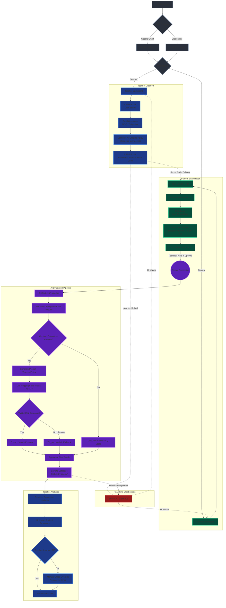

# AI-Based Exam Evaluation System

[](https://opensource.org/licenses/ISC)  
[](https://reactjs.org/)  
[](https://nodejs.org/)  
[](https://expressjs.com/)  
[](https://www.mongodb.com/)
[](https://huggingface.co/)

A production-grade, full-stack MERN (MongoDB, Express, React, Node.js) exam management system engineered for educational institutions. The platform pairs real-time reactive interfaces with an automated, AI-driven assessment pipeline evaluating both objective (MCQ) and subjective responses using the **Hugging Face Mistral-7B Inference API**.

---

## ✨ System Highlights

This platform handles the entire assessment lifecycle—from exam drafting to AI-assisted grading and data analytics—while maintaining a resilient architecture that prevents data loss and secures student integrity.

**Core Technical Features:**
- 🤖 **Automated Subjective Grading**: Direct integration with Hugging Face LLMs to evaluate long-form subjective text against teacher-defined rubrics.
- ⚡ **Detached Asynchronous Pipeline**: Safely queues and processes heavy AI tasks without blocking client HTTPS connections.
- 🎨 **Glassmorphic Responsive UI**: A premium, state-aware dashboard featuring dark/light modes and dynamic Recharts analytics.
- 💾 **Resilient Autosaving**: WebSockets and debounced REST calls persist student progress every 30 seconds to survive network drops.
- 🔐 **Hardened Security**: Complete JWT flow, Google OAuth bindings, BCrypt hashing, and Express Rate-Limiting.

---

## 🚀 How It Works (Architecture Deep Dive)

Understanding the internal flow of the system is critical for developers and contributors looking to scale the platform.


```mermaid
flowchart TD
    %% Core Authentication %%
    Start[Landing Page] --> Auth{Auth Strategy}
    Auth -->|Google OAuth| ValidTkn[Validate idToken]
    Auth -->|Credentials| Bcrypt[Verify Password]
    ValidTkn --> RoleCheck{User Role?}
    Bcrypt --> RoleCheck
    
    %% Setup Styles %%
    classDef auth fill:#2a303c,stroke:#94a3b8,stroke-width:2px;
    classDef teacher fill:#1e3a8a,stroke:#60a5fa,stroke-width:2px;
    classDef student fill:#064e3b,stroke:#34d399,stroke-width:2px;
    classDef ai fill:#5b21b6,stroke:#c084fc,stroke-width:2px;
    classDef socket fill:#991b1b,stroke:#f87171,stroke-width:2px;

    class Start,Auth,ValidTkn,Bcrypt,RoleCheck auth;

    %% Branching %%
    RoleCheck -->|Teacher| T[Teacher Dashboard]
    RoleCheck -->|Student| S[Student Dashboard]

    %% TEACHER FLOW 1: Creation %%
    subgraph Teacher Creation
        T --> T1[Create Exam <br><i>Draft Status</i>]
        T1 --> T2[Build Questions <br><i>MCQ / Subjective</i>]
        T2 --> T3[Configure AI Grading Policy <br><i>Strictness, Word Limits</i>]
        T3 --> T4[Publish Exam <br><i>Generates Secret Search Code</i>]
    end
    class T1,T2,T3,T4 teacher;

    %% STUDENT FLOW 1: Submitting %%
    subgraph Student Examination
        S --> S1[Input Search Code]
        S1 --> S2[Validate Time Window]
        S2 --> S3[Start Exam <br><i>Live Timer Active</i>]
        S3 --> S4[Real-time Autosave <br><i>Debounced PATCH every 30s</i>]
        S4 --> S5[Time Expires or Submit]
        S5 -->|Payload: Texts & Options| EvalTrig((Trigger Processing))
    end
    class S,S1,S2,S3,S4,S5 student;
    T4 -.->|Secret Code Delivery| S1

    %% ASYNC AI FLOW %%
    subgraph AI Evaluation Pipeline
        EvalTrig --> P1[Set Status: <i>Evaluating</i>]
        P1 --> P2[Detached Background Job Queued]
        P2 --> P3{Contains Subjective Answers?}
        P3 -->|No| P4[Calculate Native MCQ Score]
        P3 -->|Yes| P5[Generate Prompt + Teacher Policy]
        P5 --> P6[Call Hugging Face 'Mistral-7B' API]
        P6 --> P7{Valid JSON Response?}
        P7 -->|Yes| P8[Extract 'score' & 'review']
        P7 -->|No / Timeout| P9[Trigger Heuristic Fallback]
        P8 --> P10[Aggregate Final Grade]
        P9 --> P10
        P4 --> P10
        P10 --> P11[Save to Database <br> Status: <i>Evaluated</i>]
    end
    class P1,P2,P3,P4,P5,P6,P7,P8,P9,P10,P11,EvalTrig ai;

    %% TEACHER FLOW 2: Analytics & Overrides %%
    subgraph Teacher Analytics
        P11 --> T5[Recharts Dashboard Updates]
        T5 --> T6[Drilldown Student Responses]
        T6 --> T7{Teacher Approves AI?}
        T7 -->|Yes| T8[Results Finalized]
        T7 -->|No| T9[Manual Grade Override <br><i>Replace AI Script</i>]
        T9 --> T8
    end
    class T,T5,T6,T7,T8,T9 teacher;

    %% WEBSOCKET EVENTS %%
    subgraph Real-Time WebSockets
        Socket[Socket.IO Event Bus]
        T4 -.->|exam-published| Socket
        P11 -.->|submission-updated| Socket
        Socket -.->|UI Mutate| S
        Socket -.->|UI Mutate| T
    end
    class Socket socket;
```

### 1. The Authentication Layer
The system uses dual-layered authentication. Users can register natively (using BCrypt hashed passwords) or utilize **Google OAuth**. During an OAuth flow, the client intercepts a Google `idToken` and securely transmits it to the Node.js backend. The `google-auth-library` validates the token and maps the user's Google email to an internal Student/Teacher account, issuing secure JSON Web Tokens (JWTs) tracking session limits.

### 2. The Exam Lifecycle
Exams transition through several strict states controlled by the `ExamStatus.service`:
- **Draft**: Teachers craft questions (MCQs, Subjective). Exam is completely hidden. (Delete allowed).
- **Scheduled**: Exam is published but the `startTime` is in the future. Students see a countdown clock.
- **Live**: Exam is active. Students can fetch questions and submit. Server rejects any submissions past `endTime`.
- **Completed**: Exam timer expires. In-progress exams are force-submitted.

### 3. The AI Evaluation Pipeline (Detached IIFE)
When a student finishes an exam containing subjective text, the server receives the `POST /submit` payload. 
Instead of forcing the student's browser to wait for the LLM to read and grade every question, the server instantly replies `200 OK` and marks the exam as `evaluating`.

Behind the scenes, a detached background process takes over:
1. **Extraction**: It pulls the student's text, the question context, and the teacher's grading rubric (e.g. *Strictness: High, Expected Length: 50 words*).
2. **Prompt Injection**: The data is formatted into an immutable system prompt.
3. **Hugging Face Inference**: The Payload is thrown to the generic `HF_API_URL` (Mistral-7B). The model is strictly instructed to return raw JSON containing a `score` and `review`.
4. **Resilience Parsing**: If the LLM returns broken JSON, the system dynamically attempts to repair it. If it fails entirely or the network drops, a **Heuristic Fallback** evaluates the sentence structure and tags the teacher for manual override.
5. **Database Commit**: The MongoDB `Submission` state changes to `evaluated` and the teacher explores the visual analytics!

### 4. Real-Time WebSockets
`Socket.IO` is responsible for live state monitoring. When an exam goes from *Scheduled* to *Live*, or when a student completes an evaluation, the backend immediately emits `exam-updated` or `submission-updated` payloads. The frontend React contexts dynamically reload data without manual refreshing.

---

## 🛠️ Setting Up Local Development

If you wish to run this server locally, contribute to the code, or explore the features, follow these deep-dive steps.

### Prerequisites
- **Node.js**: v18.0.0 or higher
- **MongoDB**: A local instance (`mongodb://localhost:27017`) or an Atlas cloud cluster.
- **Hugging Face API Token**: Required to unlock subjective AI evaluations.
- **Google Cloud Console**: An active Client ID to test the external OAuth flows.

### 1. Repository Setup

```bash
git clone https://github.com/yourusername/AI-Based-Exam-Evaluation-System.git
cd AI-Based-Exam-Evaluation-System
```

### 2. Backend Environment Initialization
Navigate to the `server` directory and install the heavy backend dependencies (Express 5, Mongoose, Socket.IO, Google Auth).

```bash
cd server
npm install
```

Create a root `server/.env` file with the exact structure below:

```env
# Database & Core Security
MONGODB_URI=mongodb://localhost:27017/exam-evaluation
PORT=3003
NODE_ENV=development
CORS_ORIGIN=http://localhost:5173

# JWT Configuration
ACCESS_TOKEN_SECRET=your-secure-access-token-key
REFRESH_TOKEN_SECRET=your-secure-refresh-token-key

# Google OAuth Server Secret
GOOGLE_CLIENT_ID=your-google-client-id.apps.googleusercontent.com

# Hugging Face AI Pipeline Configuration
# Using Mistral 7B for rapid JSON returns
HF_API_URL=https://api-inference.huggingface.co/models/mistralai/Mistral-7B-Instruct-v0.2
HF_API_KEY=hf_your_hugging_face_secret_token
EVAL_MAX_RETRIES=1
EVAL_TIMEOUT_MS=15000
```
Start up the server using Nodemon:
```bash
npm run dev
```

### 3. Frontend Environment Initialization
In a new terminal window, initialize the Vite 7 client application.

```bash
cd client
npm install
```

Create a root `client/.env` file mapping identical variables for the browser:
```env
VITE_API_BASE_URL=http://localhost:3003
VITE_GOOGLE_CLIENT_ID=your-google-client-id.apps.googleusercontent.com
```

Boot the frontend Vite server:
```bash
npm run dev
```
Navigate to `http://localhost:5173`. 

---

## 🧪 Testing the API

The backend comes pre-packaged with a robust CLI API testing suite. It simulates auth boundaries, malformed requests, evaluation queue checks, and database cleanup. 

To run the comprehensive test script against your running local server:
```bash
cd server
node test_api.mjs
```
*Note: Make sure your `server/src/server.js` is running on PORT 3003 (or PORT 8000 depending on the `test_api.mjs` config) before firing the test suite.*

---

## 🤝 Contributing Guidelines

We actively welcome Pull Requests to enhance the assessment engine or stabilize front-end flows.

**Feature Branch Workflow:**
1. Fork the repo and jump to a fresh branch: `git checkout -b feature/issue-tracking-upgrade`.
2. Please align any new React components to the existing CSS variable architecture inside `client/src/index.css` (e.g., `var(--surface)`, `var(--text)`).
3. If adjusting AI logic, ensure the Detached Evaluation process inside `server/src/services/evaluation.service.js` doesn't block the `asyncHandler`.
4. Push your branch: `git push origin feature/issue-tracking-upgrade` and open a PR!

---

## 🛣️ Long-Term Roadmap

- **Drag-And-Drop Exam Builders**: We have injected `@hello-pangea/dnd` into the `package.json`. Next step is a Notion-style block editor for teachers drafting massive exams.
- **Scale Evaluation Infrastructure**: Shifting the IIFE memory loop toward a formal Redis / BullMQ caching architecture for 10k+ concurrent student evaluations.
- **WebRTC Monitoring**: Secure camera tracking toggles for heavily proctored test configurations.
- **Results Export**: `json2csv` CSV dumps and PDF generations for school archives.

---

## 📝 License & Authors

- **Anurag Basuri** - Initial Platform Architect
- Licensed comprehensively under the **ISC License**.

*Powered by the MERN Ecosystem and Hugging Face Transformative LLMs.*
